# PrepGenius AI — System Architecture Document (SAD)

**Derived from:** PRD v4
**Author role:** Principal Software Architect
**Status:** v1.0 — for engineering kickoff
**Last updated:** 30 May 2026
**Optimization targets:** MVP delivery · single-VPS deployment · low operational cost · clean path to scale

---

## 0. Reading guide & architectural principles

This document specifies *how* to build the platform described in PRD v4. Two PRD decisions shape everything below and are worth stating once:

1. **The platform is exam-driven, not CTET-specific.** Every exam is a configuration record (`Exam → Subject → Topic → Subtopic` + rules, blueprint, passing criteria, analytics rules). No exam is hardcoded; CTET is simply the first *instance*. Every engine — exam, analytics, AI generation, daily practice — reads this config.
2. **The AI credit ledger is the single control point for all AI spend.** Credits are the user-facing unit; tokens are the backend cost. Every AI call debits the ledger *before* it runs. This is both the monetization mechanism and the margin-protection mechanism.

### Guiding principles
- **Modular monolith first.** One Django codebase with strict app boundaries (clear domains, service layer, no cross-app model reach-ins). This gives monolith simplicity for the MVP and clean seams to extract services later — without a rewrite.
- **Config over code.** New exams, reminder types, and credit rules are data, not deployments.
- **Stateless app tier.** All state lives in Postgres / Redis / object storage, so the app tier can be replicated later with zero refactor.
- **Cost-aware by default.** Cache AI responses, route to the cheapest capable model, meter everything.
- **Trust is the product.** No AI-generated content reaches a user without passing the human review state machine.
- **Design for minors' data now, even though MVP exams are for adults.** The `audience_is_minor` flag and consent paths exist from day one (Sainik/Navodaya are future entrance exams for children).

### Non-functional requirements (MVP targets)
| NFR | Target |
|---|---|
| Concurrent users (pilot→Phase 1) | 100–500 |
| API p95 latency (non-AI) | < 400 ms |
| Mock submission durability | No lost answers under flaky network (offline-resilient + idempotent) |
| AI tutor first-token latency | < 2 s (Groq default) |
| Availability | ~99% single-VPS (best-effort; DR documented) |
| RPO / RTO | RPO ≤ 24 h (hourly WAL → ≤ 1 h target) · RTO ≤ 4 h |
| Data residency | India-preferred for PII (DPDP) |

---

## 1. High-Level Architecture

A layered, single-host deployment for the MVP. All services run as containers on one owned VPS behind Nginx; external SaaS handles payments, messaging, and AI inference.

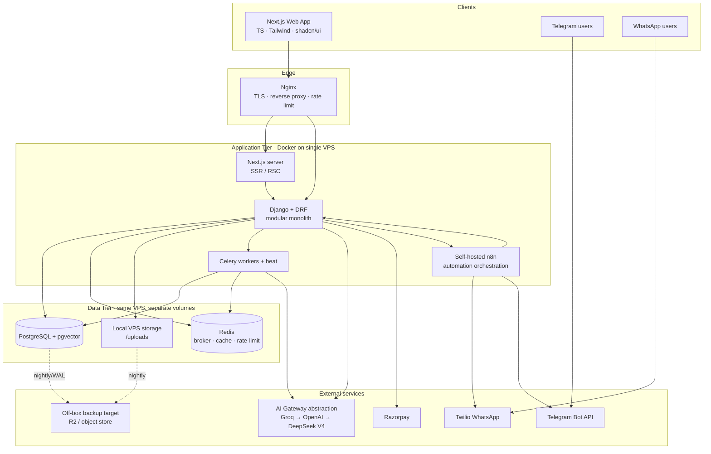

**Why this shape for MVP:** one host, Docker Compose, no managed services = lowest cost. Every external dependency is an API call, not infrastructure to run. The seams (AI Gateway as an abstraction, n8n as the orchestration boundary, stateless app tier) are exactly where we will later cut to scale (§17).

---

## 2. Component Diagram

Internal domains are Django apps with explicit dependencies. Arrows point from caller to callee; there are no cyclic dependencies.

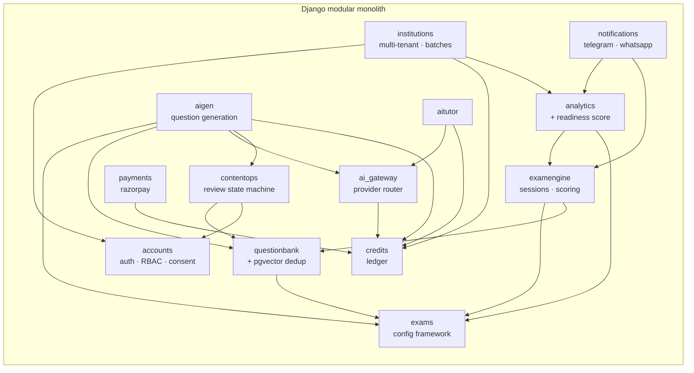

**Key dependency rules:** `credits` is depended-on by every AI-consuming domain (no AI call skips the ledger). `exams` (config) is depended-on by every engine. `ai_gateway` is the *only* module that talks to AI providers — nothing else imports an SDK.

---

## 3. Backend Architecture

**Framework:** Django + Django REST Framework, organized as a **modular monolith** with a **service-layer** pattern.

### Layering (per app)
```
api/        DRF views + serializers (thin; HTTP only)
services/   business logic (transaction boundaries, orchestration)
selectors/  read queries (no side effects)
models/     ORM models
tasks/      Celery tasks
```
Views never contain business logic; they call services (writes) and selectors (reads). This keeps domains testable and extractable.

### API design
- Versioned under `/api/v1/`; JSON; cursor pagination for large lists.
- DRF permissions enforce RBAC (§5) and tenant scoping (§12) at the view layer; services re-assert invariants.
- OpenAPI schema auto-generated (`drf-spectacular`) → typed client for the frontend.

### AI provider abstraction (critical)
`ai_gateway` exposes a single interface and hides providers behind a **strategy + fallback chain**:

```
AIGateway.complete(operation, prompt, lang, context)
  → estimate credits → CreditLedger.reserve()
  → try Groq (default) → on error/timeout → OpenAI → DeepSeek V4
  → on success: CreditLedger.commit(actual) ; cache if cacheable
  → on total failure: CreditLedger.release()
```
Provider selection, model-per-operation, and the fallback order are **configuration**, not code. This means adding/reordering providers (or pinning a cheaper model for explanations vs. generation) is an env/DB change.

### Async processing
- **Celery + Redis** (broker + result backend). Queues separated by workload so a slow job never blocks a fast one:
  - `default` — light tasks (notifications enqueue, cache warmups)
  - `ai` — tutor/generation calls (rate-and-credit-bounded)
  - `ingest` — PDF extraction, dedup, embedding (CPU/IO heavy)
  - `analytics` — aggregation, readiness score recompute
- **Celery beat** drives schedules: daily-practice generation, reminder triggers, analytics rollups, monthly credit resets.
- Tasks are **idempotent** and safe to retry (important for messaging and credit operations).

### Configuration & secrets
- 12-factor env vars; secrets injected at container runtime (never in the image or repo). `django-environ`.

---

## 4. Frontend Architecture

**Stack:** Next.js (App Router) · TypeScript · Tailwind · shadcn/ui.

### Rendering & data
- **Server Components / SSR** for first paint and SEO-relevant/marketing pages; **Client Components** for interactive surfaces (mock player, dashboards).
- Server-side data fetching for authenticated reads; **TanStack Query** on the client for cache + optimistic updates.
- Typed API client generated from the DRF OpenAPI schema → end-to-end type safety.

### Internationalization (Assamese-first)
- `next-intl` (or equivalent) with **Assamese as the default locale**, English/Hindi as alternates. All strings externalized; AI tutor responses honor the user's `preferred_language`. This is a product moat (PRD §4.1), so i18n is structural, not an afterthought.

### Mock player — offline resilience (key requirement)
Network is assumed flaky (tier-2/3, low-end Android):
- Exam session state (answers, marks, current index) is buffered in **IndexedDB**.
- Each answer save is an **idempotent** PATCH keyed by `(session_id, question_id)`; retried with backoff.
- Timer is **server-authoritative** (server stores `started_at` + `duration`); the client renders a countdown but the server computes remaining time and enforces auto-submit, so clock tampering and disconnects don't grant/lose time.
- On reconnect, the client syncs the buffer; on final submit, server reconciles.

### Structure
```
app/                routes (RSC)
components/ui/       shadcn primitives
features/           feature modules (mock-player, dashboard, tutor, institution)
lib/api/            generated client + query hooks
lib/i18n/           locale resources
```
- **No localStorage for auth tokens** — auth via httpOnly cookies (§5).
- Low-bandwidth budget: code-split per feature, lazy-load the tutor, avoid heavy client bundles on the mock player.

---

## 5. Authentication Architecture

**Mechanism:** JWT (access + refresh) via `djangorestframework-simplejwt`, delivered in **httpOnly, Secure, SameSite cookies** (not localStorage) to mitigate XSS token theft.

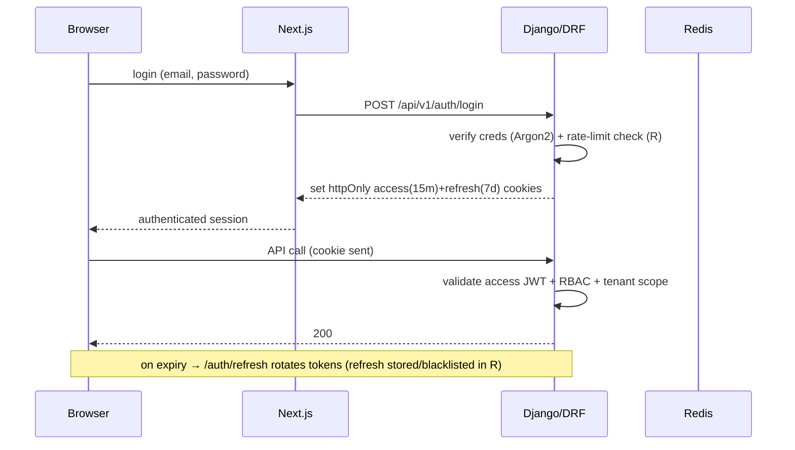

### Identity & verification
- Email verification (token link) and **OTP** (email for MVP; mobile OTP via Twilio when SMS is enabled). Password reset via signed, expiring token.
- Passwords hashed with **Argon2**. Login, OTP, and reset endpoints are **rate-limited** (Redis sliding window) and lockout-protected.

### RBAC
Roles map directly to PRD domains:

| Role | Scope |
|---|---|
| `student` | own data, practice, tutor |
| `teacher` | own batches (institution-scoped) |
| `institution_admin` | own institution, batches, pooled credits |
| `content_manager` | uploads, exam structures, subjects/topics |
| `content_reviewer` | review/edit/approve/reject questions |
| `sme` | accuracy/syllabus validation, difficult items |
| `platform_admin` | global |

Permissions enforced at DRF permission classes + object-level checks; **every institution-scoped query is filtered by `institution_id`** (§12).

### Consent (DPDP)
Signup captures explicit consent records (purpose, timestamp, version). The `audience_is_minor` path (future minor exams) additionally requires verifiable parental consent before account activation.

---

## 6. Question Bank Architecture

The question bank is the core content asset and the source of the data moat (PRD §4.4, §21).

### Data model (core)
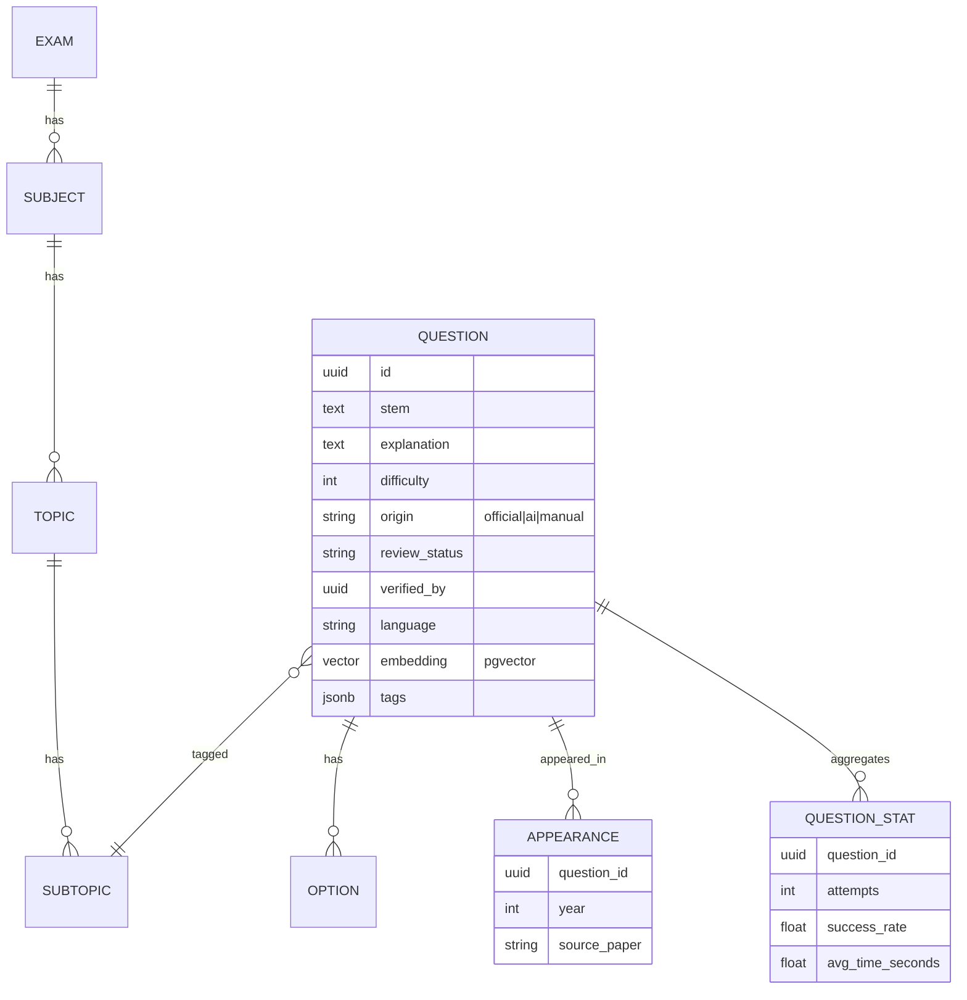

### Master question + appearance history
Duplicate questions across years collapse into **one master question** with an `APPEARANCE[]` history (`appeared in 2021, 2022, 2024`) — enabling trend/frequency analysis without duplicate clutter.

### Duplicate detection (no separate vector DB)
- Each question gets an **embedding stored in a `pgvector` column**.
- On ingest, candidate duplicates are found by **cosine similarity** (`<=>`) above a threshold, with an **IVFFlat/HNSW index** for speed; a **pg_trgm** lexical pass catches near-identical wording. Matches are surfaced to a reviewer, never auto-merged.

### Performance intelligence
`QUESTION_STAT` accumulates attempts, success rate, and average time — feeding analytics, readiness scoring, adaptive practice, and the long-term data asset.

---

## 7. Exam Engine Architecture

**Config-driven:** the engine reads an `ExamConfig` and never hardcodes an exam. Exam types: topic practice, subject practice, mixed, previous-year paper, full mock.

### Session state machine
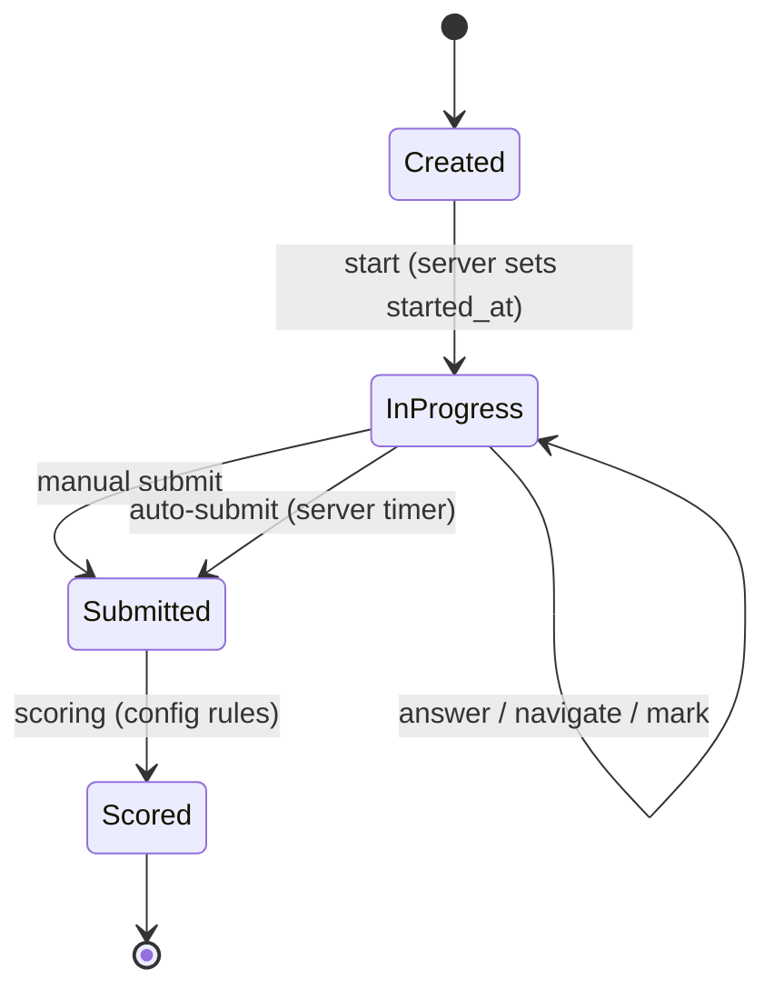

### Per-question states (rendered client-side, authoritative server copy)
`Not Visited → Visited → Answered → Marked → Answered+Marked`

### Scoring
- Scoring rules (marks, negative marking, section cutoffs, passing criteria) come from `ExamConfig.exam_rules` / `passing_criteria`. CTET has **no negative marking**; a ranked exam might — the engine doesn't care, it reads config.
- Scoring runs in the `analytics` queue immediately on submit; results are framed against the **per-section pass line** (PRD §6, §10.6).

### Reliability
- Server-authoritative timer; idempotent answer writes; auto-submit guaranteed by a Celery `beat`/`eta` task even if the client never returns.

---

## 8. Analytics Engine Architecture

Two tiers: **real-time** (per submission) and **batch** (rollups).

- **On submit:** compute total/correct/incorrect/skipped, accuracy, subject & topic accuracy, time analytics (avg/fastest/slowest), all against config analytics rules and the pass line.
- **Batch (Celery beat):** maintain rolling **7/30/90-day** trends and per-user aggregates in summary tables (avoids re-scanning attempt history on every dashboard load).
- **Materialized aggregates** keep dashboards fast on a single VPS; recomputed incrementally.

### Exam Readiness Score
A heuristic composite (weights in `ExamConfig.analytics_rules`) of: mock performance, subject accuracy, topic accuracy, time management, consistency, practice completion, historical trend → a single **Readiness %** plus strong/weak areas and recommendations.

> **Pass-probability is deferred by design:** a calibrated probability needs real pass/fail outcome labels, which don't exist until exam cycles complete. The readiness score ships first; the probability model is a future enhancement trained on accumulated outcomes (§21 data asset).

---

## 9. AI Tutor Architecture

The tutor answers "why is B correct?", "explain in Assamese", "give another example", etc. **No vector DB / RAG in MVP** (per PRD) — context is assembled directly from the question record.

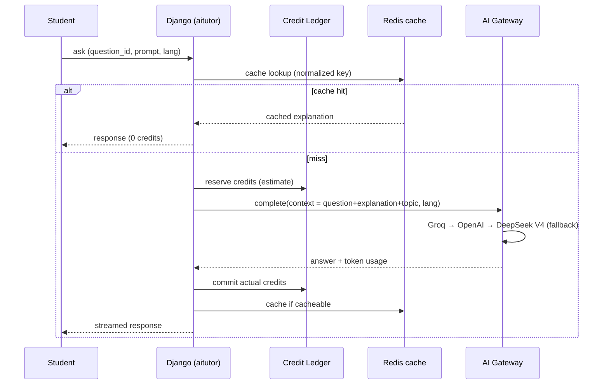

- **Context** = question stem + options + official explanation + topic metadata (+ user's recent mistakes for personalization). Bounded prompt → predictable cost.
- **Caching:** common explanations (same question + same intent + same language) are cached → repeat asks cost zero credits, protecting margin.
- **Streaming** for perceived latency.
- **Credit-metered** (§13) and rate-limited; the tutor cannot run without a successful reserve.
- **Prompt-injection hygiene:** user text is treated as data, never as system instructions; outputs are scoped to the educational context.

---

## 10. AI Question Generation Workflow

Generation is **exam-config-driven** and **draft-only** — it never publishes.

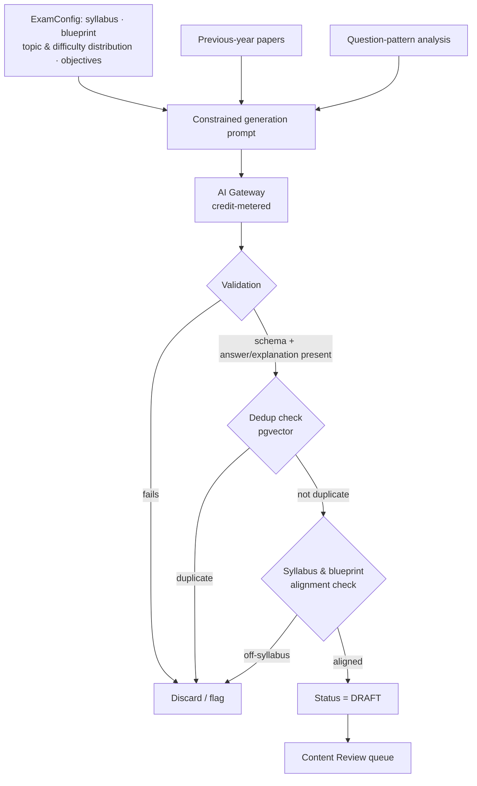

**Mandatory constraints (from `ExamConfig`):** follow official syllabus, PYQ patterns, topic distribution, difficulty distribution, exam blueprint, and learning objectives; avoid unsupported concepts; always produce answer + explanation. Generated items enter the review state machine (§11) as `DRAFT` and are **visually distinguished from official questions** until approved.

---

## 11. Content Review Workflow

RBAC-driven, multi-reviewer state machine. Trust depends on this gate (PRD §12).

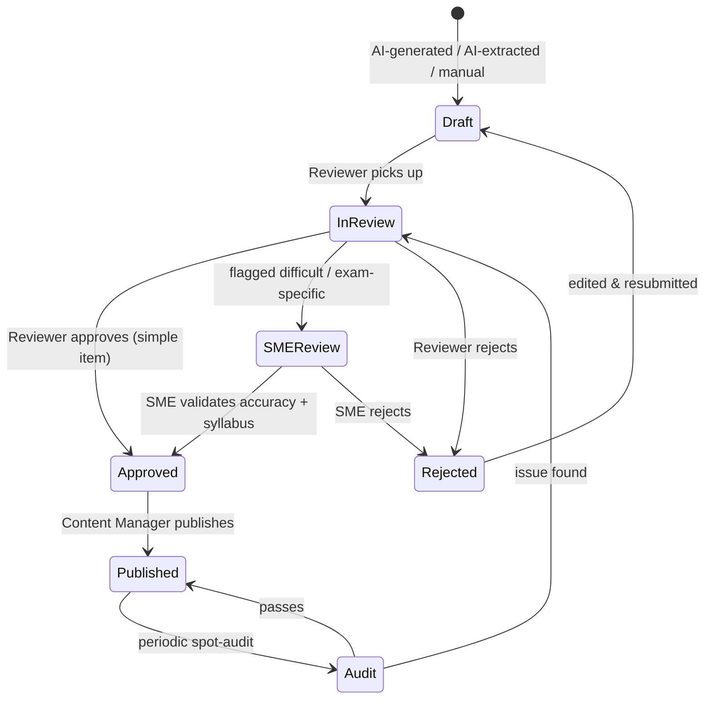

### Roles (RBAC)
- **Content Manager** — uploads PYQ/syllabus; manages subjects, topics, exam structures; publishes approved items.
- **Content Reviewer** — reviews, edits, approves/rejects; verifies explanations.
- **SME** — validates accuracy and syllabus alignment; handles difficult/exam-specific items.

Every transition is **audit-logged** (`who/when/from→to/reason`). At MVP these roles are the founder (one account, multiple roles); the **state machine and RBAC exist now** so staffing them later needs no rebuild.

---

## 12. Institution Architecture

**Multi-tenancy model:** **shared schema with `institution_id` row-scoping** (cheapest to operate on a single VPS; isolation enforced in code + DB constraints). A future move to schema-per-tenant is possible but unnecessary at this scale.

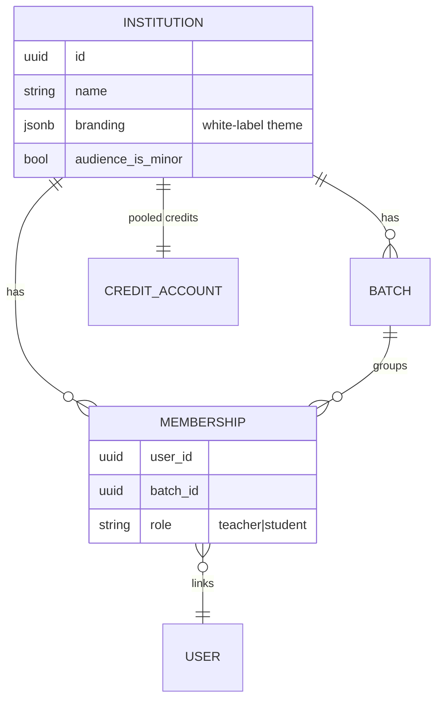

- **Teacher Dashboard:** batch student performance, weak students surfaced, attendance, practice completion.
- **Batch Analytics:** topic-level and class-level trends, cohort comparison (reuses the analytics engine, scoped by batch).
- **Custom Mock Tests:** teachers assemble mocks from approved questions (still exam-config-aware).
- **White-label:** per-institution branding/theme (`branding` JSONB) applied at the Next.js layer.
- **Pooled credits:** the institution holds one `CreditAccount`; member AI usage debits the pool (§13).

**Isolation guarantee:** a single Django manager mixin auto-filters every institution-scoped queryset by the requester's `institution_id`; cross-tenant access is impossible through the API surface.

---

## 13. AI Credit Architecture

A **ledger** is the single source of truth for AI entitlement and the margin-protection mechanism. Credits = user-facing unit; tokens = backend cost.

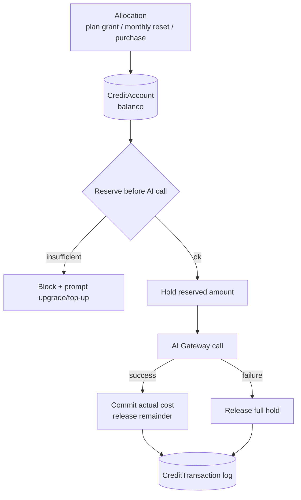

### Model
- `CreditAccount` — one per **user** (individual plans) or per **institution** (pooled). Holds `balance`.
- `CreditTransaction` — append-only log: `grant | reserve | commit | release | purchase | refund`, with `operation` (tutor/explanation/doubt/guidance/generation), `model_used`, `tokens`, `credits`.
- **Token→credit map** is config per `(operation, model)` — so Groq vs OpenAI vs DeepSeek cost different credits, and pricing can be tuned without code.

### Guarantees
- **Reserve-then-commit** with a DB row lock makes debits atomic and double-spend-safe under concurrency.
- **Cache hits cost zero credits.**
- **Monthly reset / top-ups** run via Celery beat; institutions can **purchase additional credits** (Razorpay → `grant`).
- **Margin protection:** a monitored ratio (AI cost ÷ plan revenue per paying user); if it crosses a threshold, routing auto-shifts to cheaper models and/or tightens per-user caps.

This unifies PRD §5.2 (credits) and §20.2 (cost governance) into one mechanism — no parallel systems.

---

## 14. Telegram Automation Architecture

Telegram is the **primary** community + automation channel (PRD §17). Orchestration lives in **n8n**; the bot is a thin transport.

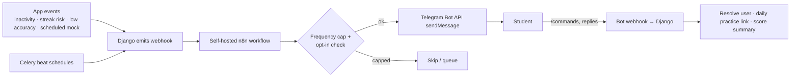

- **Triggers:** daily inactivity, weak-topic (accuracy < 50%), streak-at-risk, scheduled mock, weekly motivational (PRD §10.11).
- **Bot features:** daily practice link, mock reminders, score summary, weekly performance report, live doubt threads (community).
- **Idempotency + frequency caps** prevent spam and double-sends; all sends are opt-in.
- **Why n8n here:** reminder logic changes often (copy, timing, audience) — keeping it in visual workflows means no redeploy to iterate, and it leverages the founder's automation strength.

---

## 15. WhatsApp Reminder Architecture

WhatsApp via **Twilio** is the higher-trust **transactional** channel (reminders, results), constrained by the WhatsApp Business Platform.

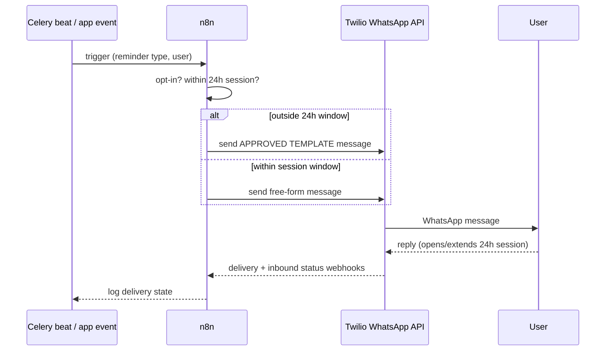

- **Approved templates** are mandatory for business-initiated messages (reminders, score summaries); submit them early (approval is not instant).
- **24-hour session window:** free-form replies only within 24 h of a user message; otherwise template-only.
- **Explicit opt-in** captured at signup; **delivery-status webhooks** update notification logs.
- Reminder catalogue mirrors Telegram (daily, weak-topic, streak, exam, motivational) but gated by template availability.

---

## 16. Deployment Architecture

**Single VPS, Docker Compose.** One host, many containers, separate volumes. Lowest cost, simplest ops.

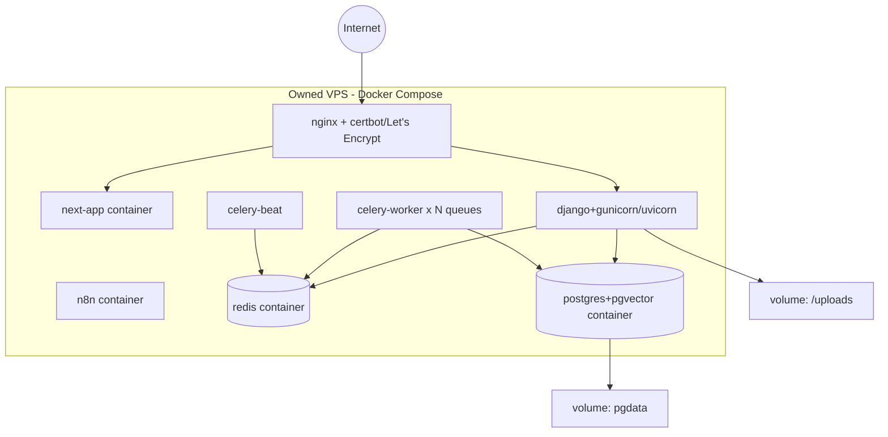

- **TLS** via Let's Encrypt (auto-renew). Nginx terminates TLS, reverse-proxies Next.js and Django, and applies edge rate limits.
- **CI/CD:** GitHub Actions → build images → push → SSH deploy / `docker compose up -d` with health-gated rollover. DB migrations run as a release step.
- **Secrets** via env files mounted at runtime (or a lightweight secrets store); never baked into images.
- **Separation of concerns** even on one host: distinct containers and volumes so any one can later move off-box without re-architecture.

---

## 17. Scalability Strategy

Scale in **stages tied to the PRD validation gates**, never preemptively (avoids the over-engineering the PRD warns against).

| Stage | Trigger | Move |
|---|---|---|
| **0 — MVP** | ≤ ~500 users | Single VPS, vertical headroom; tune Postgres, add indexes, cache hot reads in Redis |
| **1 — Headroom** | sustained CPU/IO pressure | Scale the VPS up (more cores/RAM); add Celery workers; CDN in front of Next.js static |
| **2 — Decouple data** | DB contention / backup risk | Move **Postgres to managed/replicated**; move **Redis to managed**; storage → **Cloudflare R2** |
| **3 — Horizontal app tier** | concurrency beyond one host | Multiple stateless Django + Next.js instances behind a load balancer (already stateless) |
| **4 — Extract services** | AI/ingestion dominate load or cost | Carve out **AI Gateway** and **content/ingestion** as independent services (clean seams already exist) |
| **5 — Data scale** | huge question bank / analytics | Read replicas, partition `attempts`/`question_stat`, separate analytics store |

**Designed-in enablers:** stateless app tier, AI calls already isolated behind one gateway, automation already external (n8n), object-storage abstraction for uploads, modular-monolith boundaries that map 1:1 to future services. **Known bottlenecks to watch:** AI cost (mitigated by credits/cache/routing), ingestion CPU (queue-isolated), and analytics scans (mitigated by materialized aggregates).

---

## 18. Security Architecture

- **Transport:** TLS everywhere; HSTS; secure cookie flags.
- **AuthN/Z:** Argon2 passwords; short-lived access + rotating refresh JWTs in httpOnly cookies; refresh blacklist in Redis; RBAC at the view + object level; **tenant isolation** auto-filtered by `institution_id`.
- **Rate limiting / abuse:** Redis-backed limits on auth, OTP, tutor, and generation endpoints; lockouts; credit ceilings double as AI abuse limits.
- **Input & API:** strict serializer validation; parameterized ORM queries; CORS allow-list; CSRF protection for cookie-auth flows; OpenAPI-typed contracts.
- **PII & DPDP:** minimize collected PII; **field-level encryption** for sensitive fields; consent records; data **export & deletion** endpoints; purpose limitation; breach process. **Children's data:** `audience_is_minor` gates verifiable parental consent and prohibits behavioural profiling/targeting of minors.
- **Webhooks:** verify **Razorpay** signatures, **Twilio** signatures, and **Telegram** secret tokens before processing — webhook endpoints are otherwise unauthenticated attack surface.
- **AI safety:** treat user input as data (prompt-injection hygiene); never expose provider keys to the client; the gateway is the only egress to AI providers.
- **Secrets:** runtime-injected; rotated; never in VCS or images.

---

## 19. Monitoring & Logging

Lightweight for MVP, with hooks to grow.

- **Errors:** Sentry (backend + frontend) with release tagging.
- **Logs:** structured JSON logs to stdout (Docker), shipped to a central store later (Loki/ELK); request IDs correlate web→API→task.
- **Metrics:** health-check endpoints; container/host metrics; **Celery monitored via Flower**. Prometheus + Grafana optional at Stage 1.
- **Business/cost dashboards:** the credit ledger powers an **AI spend per user/institution** view and the **margin-protection ratio** — the most important operational metric for this business.
- **Uptime + alerting:** external uptime monitor on key endpoints; alerts on error-rate spikes, queue backlogs, low disk, failed backups, and margin-ratio breaches.
- **Audit logs:** auth events, RBAC changes, content-review transitions, credit transactions, and payment events are retained for compliance.

---

## 20. Backup & Disaster Recovery

Single-VPS data loss is a named high risk (PRD §23) — backups are **non-negotiable** and **off-box**.

- **Database:** nightly `pg_dump` **plus** continuous **WAL archiving** to off-box object storage (R2/S3-compatible) → point-in-time recovery; target **RPO ≤ 1 h**, RTO ≤ 4 h.
- **Uploads:** `/uploads` synced nightly to the same off-box store (later: write-through to R2 directly).
- **Config/IaC:** Docker Compose, env templates, and n8n workflow exports kept in VCS so the host is reproducible.
- **Retention:** daily for 14 days, weekly for 3 months (tunable).
- **Restore runbook (documented + rehearsed):**
  1. Provision a fresh VPS, install Docker.
  2. Pull images, restore env/secrets.
  3. Restore Postgres (latest base + WAL replay) and `/uploads`.
  4. `docker compose up`; run health checks; re-point DNS.
- **Failure scenarios covered:** disk failure, VPS loss, accidental data deletion (PITR), corrupted deploy (image rollback). **Backups are tested by periodic restore drills** — an untested backup is not a backup.

---

## Appendix A — Key architecture decisions (ADR summary)

| # | Decision | Rationale | Reversible? |
|---|---|---|---|
| 1 | Modular monolith (not microservices) | Lowest cost/complexity for MVP; clean seams to extract later | Yes — boundaries already drawn |
| 2 | Exam config as data | Onboard exams without code changes (PRD §19) | Hard to reverse — foundational |
| 3 | Credit ledger as single AI control point | Unifies monetization + margin protection | Hard — core invariant |
| 4 | pgvector in Postgres (no separate vector DB) | Dedup + future semantic features, zero extra infra | Yes — can externalize |
| 5 | httpOnly-cookie JWT (no localStorage) | XSS-resistant auth | Yes |
| 6 | n8n owns reminder orchestration | Iterate messaging without redeploys; leverages founder skill | Yes |
| 7 | Server-authoritative exam timer | Integrity under flaky networks / tampering | No — correctness requirement |
| 8 | Single AI gateway with configurable fallback chain | Provider independence (Groq→OpenAI→DeepSeek V4); cost control | Yes |
| 9 | Shared-schema multi-tenancy with row scoping | Cheapest isolation at this scale | Yes — can move to schema-per-tenant |

## Appendix B — Traceability to PRD v4
Exam framework → §1, §6, §7, §19 · AI generation governance → §10 · Content-ops roles → §11 · AI credits → §13 · Adaptive practice → §7, §8 · Readiness score → §8 · Institutions → §12 · Messaging (Telegram/Twilio) → §14, §15 · Cost governance → §13, §19 · Compliance/minors → §5, §18 · Backups → §20.
