# PrepGenius AI — PostgreSQL Database Design

**Derived from:** PRD v4 + System Architecture Document v1.0
**Author role:** Senior Database Architect
**Target:** PostgreSQL 15+ (requires `pgvector`, `pg_trgm`, `citext`)
**Status:** v1.0 — production-ready schema for MVP, designed to scale

---

## 0. Conventions & extensions

### Design conventions
- **Primary keys:** `UUID` (default `gen_random_uuid()`) for entity tables — non-enumerable, safe to expose. **`BIGINT GENERATED ALWAYS AS IDENTITY`** for the four high-volume append/event tables (`user_answers`, `credit_transactions`, `reminder_logs`, `content_reviews`) where monotonic, index-local keys matter more than opacity.
- **Timestamps:** `created_at TIMESTAMPTZ NOT NULL DEFAULT now()`, `updated_at` maintained by a trigger.
- **Enumerations:** `TEXT` + `CHECK` constraint (evolvable without the pain of native `ENUM ALTER`).
- **Money/credits:** `NUMERIC(14,4)` — never floats. Tokens are `INTEGER`.
- **Multi-tenancy:** institution-owned rows carry `institution_id`; the app auto-filters every institution-scoped query (SAD §12). Key institution tables also enforce it with FKs.
- **Config-as-data:** exam rules, blueprint, passing criteria, analytics weights live in `JSONB` on `exams` — no exam is hardcoded.
- **DPDP:** PII is concentrated in `users`; deletion anonymizes PII and preserves financial/audit integrity (see §5).
- **Vector dim:** `vector(1024)` — must match the chosen embedding model; one model for dedup.

> Section 2 gives concise per-table cards (purpose / notable fields / relationships / indexes). Section 3 is the **authoritative DDL** — all columns, exact data types, and constraints live there to avoid divergence.

### Extensions
```sql
CREATE EXTENSION IF NOT EXISTS pgcrypto;   -- gen_random_uuid (also core in PG13+)
CREATE EXTENSION IF NOT EXISTS citext;     -- case-insensitive email
CREATE EXTENSION IF NOT EXISTS pg_trgm;    -- lexical dedup / fuzzy search
CREATE EXTENSION IF NOT EXISTS vector;     -- pgvector semantic dedup
CREATE EXTENSION IF NOT EXISTS btree_gin;  -- composite GIN where useful
```

### Shared trigger
```sql
CREATE OR REPLACE FUNCTION set_updated_at() RETURNS trigger AS $$
BEGIN NEW.updated_at = now(); RETURN NEW; END;
$$ LANGUAGE plpgsql;
-- attach per mutable table: CREATE TRIGGER trg_<t>_updated BEFORE UPDATE ON <t>
--                          FOR EACH ROW EXECUTE FUNCTION set_updated_at();
```

---

## 1. ER Diagram

**Domains:** Identity & Access · Exam Framework (config) · Content (questions) · Exam Engine · Analytics · Study Plans · Credits · Institutions · Content Review · Messaging.

```mermaid
erDiagram
    USERS ||--o{ USER_ROLES : has
    ROLES ||--o{ USER_ROLES : grants
    ROLES ||--o{ ROLE_PERMISSIONS : has
    PERMISSIONS ||--o{ ROLE_PERMISSIONS : in
    USERS ||--o{ USER_CONSENTS : gives
    USERS }o--|| EXAMS : "target exam"

    EXAMS ||--o{ SUBJECTS : has
    SUBJECTS ||--o{ TOPICS : has
    TOPICS ||--o{ SUBTOPICS : has
    EXAMS ||--o{ SYLLABUS_ITEMS : defines
    EXAMS ||--o{ PREVIOUS_YEAR_PAPERS : has

    SUBTOPICS ||--o{ QUESTIONS : tagged
    QUESTIONS ||--o{ QUESTION_OPTIONS : has
    QUESTIONS ||--o{ QUESTION_APPEARANCES : appeared
    PREVIOUS_YEAR_PAPERS ||--o{ QUESTION_APPEARANCES : contains
    QUESTIONS ||--|| QUESTION_STATS : aggregates
    QUESTIONS ||--o{ AI_GENERATED_QUESTIONS : "provenance"
    QUESTIONS ||--o{ CONTENT_REVIEWS : reviewed
    QUESTIONS ||--o{ CONTENT_APPROVALS : approved

    EXAMS ||--o{ MOCK_TESTS : templates
    MOCK_TESTS ||--o{ MOCK_TEST_QUESTIONS : composes
    QUESTIONS ||--o{ MOCK_TEST_QUESTIONS : in

    USERS ||--o{ EXAM_ATTEMPTS : takes
    EXAMS ||--o{ EXAM_ATTEMPTS : of
    MOCK_TESTS ||--o{ EXAM_ATTEMPTS : instantiates
    EXAM_ATTEMPTS ||--o{ USER_ANSWERS : records
    QUESTIONS ||--o{ USER_ANSWERS : answered
    EXAM_ATTEMPTS ||--o{ ATTEMPT_SECTION_ANALYTICS : breaks_down

    USERS ||--o{ USER_TOPIC_PERFORMANCE : tracks
    TOPICS ||--o{ USER_TOPIC_PERFORMANCE : per
    USERS ||--o{ WEAK_TOPICS : has
    USERS ||--o{ EXAM_READINESS_SCORES : scored
    USERS ||--o{ STUDY_PLANS : owns
    STUDY_PLANS ||--o{ STUDY_PLAN_ITEMS : contains

    CREDIT_ACCOUNTS ||--o{ CREDIT_TRANSACTIONS : ledger
    USERS ||--o| CREDIT_ACCOUNTS : "personal"
    INSTITUTIONS ||--o| CREDIT_ACCOUNTS : "pooled"

    INSTITUTIONS ||--o{ BATCHES : has
    INSTITUTIONS ||--o{ INSTITUTION_MEMBERSHIPS : members
    BATCHES ||--o{ INSTITUTION_MEMBERSHIPS : groups
    USERS ||--o{ INSTITUTION_MEMBERSHIPS : member

    USERS ||--o{ REMINDER_LOGS : receives
    USERS ||--o| TELEGRAM_SUBSCRIPTIONS : links
    USERS ||--o| WHATSAPP_PREFERENCES : links
```



---

## 2. Table specifications

### Domain A — Identity & Access

**users** — Canonical person record; sole concentration of PII (DPDP).
- Notable: `email CITEXT UNIQUE`, `phone_e164`, `password_hash` (Argon2), `preferred_language`, `target_exam_id`, `exam_date`, `is_minor`, `status`, verification flags, `deleted_at`.
- Relationships: → `exams` (target); 1:N attempts, plans, memberships, reminders; 1:1 credit account, telegram/whatsapp.
- Indexes: unique(`email`), unique(`phone_e164`) partial where not null, (`status`), (`target_exam_id`).

**roles / permissions / role_permissions / user_roles** — RBAC (SAD §5).
- `roles.name` unique; `permissions.code` unique. `user_roles` is institution-scoped (a teacher's role applies within one institution).
- Indexes: composite PKs on join tables; (`user_roles.user_id`), (`user_roles.institution_id`).

**user_consents** — DPDP consent ledger (purpose, version, parental for minors).
- Indexes: (`user_id`, `purpose`).

### Domain B — Exam Framework (config-driven)

**exams** — The config object that drives every engine. `exam_type`, `difficulty_levels JSONB`, `exam_rules JSONB`, `blueprint JSONB`, `passing_criteria JSONB`, `analytics_rules JSONB`, `audience_is_minor`, `is_active`.
- Relationships: 1:N subjects, syllabus, papers, mocks, attempts.
- Indexes: unique(`code`), (`is_active`), GIN(`blueprint`) if queried.

**subjects → topics → subtopics** — Three-level hierarchy; ordered.
- FK chain `subject.exam_id`, `topic.subject_id`, `subtopic.topic_id`; each `(parent_id, name)` unique.
- Indexes: (`exam_id`), (`subject_id`), (`topic_id`).

**syllabus_items** — Syllabus tree with `weightage` (feeds blueprint). Self-referential `parent_id`; links to exam and optionally topic/subtopic.
- Indexes: (`exam_id`), (`topic_id`).

**previous_year_papers** — Paper metadata + source file; `year`, `language`, `file_path`, `total_questions`.
- Indexes: unique(`exam_id`, `year`, `code`), (`exam_id`, `year`).

### Domain C — Content (Questions)

**questions** — Master question. `stem`, `explanation`, `difficulty`, `language`, `origin` (`official|ai|manual`), `review_status` (draft→…→published), `verified_by`, `tags JSONB`, `embedding vector(1024)`, **denormalized `exam_id`** (perf — every selector filters by exam).
- Relationships: → subtopic (canonical), 1:N options/appearances/answers; 1:1 stats; 0..1 ai provenance.
- Indexes: (`exam_id`,`subtopic_id`,`difficulty`) for practice selection; partial (`exam_id`) `WHERE review_status='published'`; (`review_status`); **HNSW** on `embedding` (`vector_cosine_ops`); **GIN trgm** on `stem`; GIN(`tags`).

**question_options** — Choices; one flagged `is_correct`.
- Indexes: (`question_id`); partial unique on correct per question (optional).

**question_appearances** — Master-question appearance history (PRD trend analysis). `(question_id, paper_id)` unique; denormalized `year`.
- Indexes: unique(`question_id`,`paper_id`), (`paper_id`).

**question_stats** — 1:1 aggregate with `questions`: `attempts`, `success_rate`, `avg_time_seconds`. Separated for write isolation / `fillfactor` tuning (high churn).
- Indexes: PK(`question_id`); (`success_rate`).

**ai_generated_questions** — Generation provenance (SAD §10): `model_used`, `prompt`, `constraints_snapshot JSONB`, `validation JSONB`, `credits_charged`, `status`, `resulting_question_id` → the draft `questions` row it produced.
- Indexes: (`exam_id`,`status`), (`resulting_question_id`).

### Domain D — Exam Engine

**mock_tests** — Mock/PYP/custom test definitions; config-aware. `type` (`system|previous_year|custom`), nullable `institution_id` + `created_by` (teacher custom mocks), `duration_seconds`, `total_questions`, `previous_year_paper_id`.
- Indexes: (`exam_id`,`type`), (`institution_id`).

**mock_test_questions** — Ordered composition. `(mock_test_id, question_id)` unique; `position`, `section`, `marks`.
- Indexes: (`mock_test_id`,`position`).

**exam_attempts** — A session (practice or mock). `attempt_type`, `status`, server `started_at`+`duration_seconds` (authoritative timer), summary (`score`,`correct`,`incorrect`,`skipped`,`accuracy`,`time_taken_seconds`), optional `institution_id`/`batch_id` for institution analytics.
- Indexes: (`user_id`,`created_at` DESC), (`user_id`,`exam_id`), (`mock_test_id`), (`institution_id`,`batch_id`).

**user_answers** *(BIGINT id, high volume)* — Per-question answer. `state` (not_visited…answered_marked), `selected_option_id`, `is_correct`, `time_spent_seconds`. `(attempt_id, question_id)` unique → **idempotent saves** (SAD §4).
- Indexes: unique(`attempt_id`,`question_id`); (`question_id`) for stats rollups; BRIN(`created_at`) for archival scans.

### Domain E — Analytics

**attempt_section_analytics** — Per-attempt breakdown rows: `scope_type` (subject/topic), `scope_id`, `total`,`correct`,`accuracy`,`avg_time`.
- Indexes: (`attempt_id`), (`scope_type`,`scope_id`).

**user_topic_performance** — Rolling per-user-per-topic aggregate feeding weak-topics, adaptive practice, readiness. `(user_id, topic_id)` unique.
- Indexes: unique(`user_id`,`topic_id`), (`user_id`,`success_rate`).

**weak_topics** — Maintained list per user: `accuracy`,`severity`,`status` (active/improving/resolved).
- Indexes: (`user_id`) partial `WHERE status='active'`, (`topic_id`).

**exam_readiness_scores** — Snapshots: `score`, `components JSONB`, strong/weak summaries.
- Indexes: (`user_id`,`exam_id`,`computed_at` DESC).

### Domain F — Study Plans

**study_plans** — `exam_id`, `exam_date`, `hours_per_day`, `status`, `plan_meta JSONB`.
**study_plan_items** — Dated tasks: `scheduled_date`, `topic_id`, `task_type` (practice/revision/mock/study), `goal_count`, `status`.
- Indexes: plans(`user_id`,`exam_id`); items(`study_plan_id`,`scheduled_date`).

### Domain G — AI Credits

**credit_accounts** — One per **user** or **institution** (pooled). `owner_type` + exactly-one-owner CHECK; `balance`, `reserved`, `plan`, `monthly_allocation`, `reset_at`.
- Indexes: unique(`user_id`) partial, unique(`institution_id`) partial.

**credit_transactions** *(BIGINT id, append-only ledger)* — `txn_type` (grant/reserve/commit/release/purchase/refund/reset), `operation`, `model_used`, `tokens`, `credits` (signed), `balance_after`, `reference_id`.
- Indexes: (`account_id`,`created_at` DESC); (`reference_id`); BRIN(`created_at`).

### Domain H — Institutions (multi-tenant)

**institutions** — `name`, `slug` unique, `branding JSONB` (white-label), `audience_is_minor`.
**batches** — `(institution_id, name)` unique.
**institution_memberships** *(covers “Institution Students” + “Institution Teachers”)* — `role` (`teacher|student|institution_admin`), nullable `batch_id`, `status`. One table with a role discriminator > two near-identical tables.
- Indexes: (`institution_id`,`role`), (`user_id`), unique(`user_id`,`batch_id`,`role`).

### Domain I — Content Review

**content_reviews** *(BIGINT id, append-only audit log)* — Every state transition: `action`, `from_status`,`to_status`, `actor_id`,`actor_role`, `comment`. References `question_id` and/or `ai_generated_question_id`.
- Indexes: (`question_id`,`created_at`), (`actor_id`).

**content_approvals** — Distinct sign-off records: `approval_level` (`reviewer|sme`), `approver_id`, `approved_at`. `(question_id, approval_level)` unique → at most one approval per level.
- Indexes: unique(`question_id`,`approval_level`).

### Domain J — Messaging & Automation

**reminder_logs** *(BIGINT id, high volume)* — `channel` (telegram/whatsapp/email), `reminder_type`, `status`, `dedup_key`, `payload JSONB`, `scheduled_for`,`sent_at`,`provider_message_id`.
- Indexes: (`user_id`,`reminder_type`,`created_at` DESC); unique partial(`dedup_key`) `WHERE dedup_key IS NOT NULL`; BRIN(`created_at`).

**telegram_subscriptions** — 1:1 user. `telegram_chat_id` unique, `opted_in`.
**whatsapp_preferences** — 1:1 user. `phone_e164` unique, `opted_in`, `last_inbound_at` (24h session window), `template_opt_ins JSONB`.

---

## 3. Authoritative DDL

```sql
-- ============ DOMAIN A: IDENTITY & ACCESS ============
CREATE TABLE users (
    id              UUID PRIMARY KEY DEFAULT gen_random_uuid(),
    email           CITEXT NOT NULL UNIQUE,
    phone_e164      VARCHAR(20),
    password_hash   TEXT NOT NULL,
    full_name       VARCHAR(150) NOT NULL,
    preferred_language VARCHAR(10) NOT NULL DEFAULT 'as',  -- Assamese-first
    target_exam_id  UUID,                                  -- FK added after exams
    exam_date       DATE,
    is_minor        BOOLEAN NOT NULL DEFAULT FALSE,
    status          TEXT NOT NULL DEFAULT 'pending'
                    CHECK (status IN ('pending','active','suspended','deleted')),
    is_email_verified BOOLEAN NOT NULL DEFAULT FALSE,
    is_phone_verified BOOLEAN NOT NULL DEFAULT FALSE,
    last_login_at   TIMESTAMPTZ,
    deleted_at      TIMESTAMPTZ,
    created_at      TIMESTAMPTZ NOT NULL DEFAULT now(),
    updated_at      TIMESTAMPTZ NOT NULL DEFAULT now()
);
CREATE UNIQUE INDEX ux_users_phone ON users(phone_e164) WHERE phone_e164 IS NOT NULL;
CREATE INDEX ix_users_status ON users(status);
CREATE INDEX ix_users_target_exam ON users(target_exam_id);

CREATE TABLE roles (
    id          UUID PRIMARY KEY DEFAULT gen_random_uuid(),
    name        VARCHAR(50) NOT NULL UNIQUE,
    description TEXT,
    is_system   BOOLEAN NOT NULL DEFAULT FALSE
);

CREATE TABLE permissions (
    id          UUID PRIMARY KEY DEFAULT gen_random_uuid(),
    code        VARCHAR(80) NOT NULL UNIQUE,   -- e.g. 'question.approve'
    description TEXT
);

CREATE TABLE role_permissions (
    role_id       UUID NOT NULL REFERENCES roles(id) ON DELETE CASCADE,
    permission_id UUID NOT NULL REFERENCES permissions(id) ON DELETE CASCADE,
    PRIMARY KEY (role_id, permission_id)
);

CREATE TABLE user_roles (
    user_id        UUID NOT NULL REFERENCES users(id) ON DELETE CASCADE,
    role_id        UUID NOT NULL REFERENCES roles(id) ON DELETE CASCADE,
    institution_id UUID,                         -- nullable: global vs institution-scoped
    granted_at     TIMESTAMPTZ NOT NULL DEFAULT now(),
    PRIMARY KEY (user_id, role_id, institution_id)
);
CREATE INDEX ix_user_roles_user ON user_roles(user_id);
CREATE INDEX ix_user_roles_inst ON user_roles(institution_id);

CREATE TABLE user_consents (
    id              UUID PRIMARY KEY DEFAULT gen_random_uuid(),
    user_id         UUID NOT NULL REFERENCES users(id) ON DELETE CASCADE,
    purpose         VARCHAR(80) NOT NULL,
    consent_version VARCHAR(20) NOT NULL,
    granted         BOOLEAN NOT NULL,
    is_parental     BOOLEAN NOT NULL DEFAULT FALSE,   -- minors
    guardian_ref    VARCHAR(150),
    ip_address      INET,
    granted_at      TIMESTAMPTZ NOT NULL DEFAULT now()
);
CREATE INDEX ix_consents_user ON user_consents(user_id, purpose);

-- ============ DOMAIN B: EXAM FRAMEWORK ============
CREATE TABLE exams (
    id                UUID PRIMARY KEY DEFAULT gen_random_uuid(),
    code              VARCHAR(40) NOT NULL UNIQUE,   -- 'CTET_P2_SCI'
    name              VARCHAR(150) NOT NULL,
    exam_type         TEXT NOT NULL
                      CHECK (exam_type IN ('qualifying','ranked','entrance')),
    difficulty_levels JSONB NOT NULL DEFAULT '["easy","medium","hard"]',
    exam_rules        JSONB NOT NULL DEFAULT '{}',   -- marks, negative marking, sections
    blueprint         JSONB NOT NULL DEFAULT '{}',   -- topic/difficulty distribution
    passing_criteria  JSONB NOT NULL DEFAULT '{}',   -- per-section pass line
    analytics_rules   JSONB NOT NULL DEFAULT '{}',   -- readiness-score weights
    audience_is_minor BOOLEAN NOT NULL DEFAULT FALSE,
    is_active         BOOLEAN NOT NULL DEFAULT TRUE,
    created_at        TIMESTAMPTZ NOT NULL DEFAULT now(),
    updated_at        TIMESTAMPTZ NOT NULL DEFAULT now()
);
CREATE INDEX ix_exams_active ON exams(is_active);

ALTER TABLE users
    ADD CONSTRAINT fk_users_target_exam
    FOREIGN KEY (target_exam_id) REFERENCES exams(id) ON DELETE SET NULL;

CREATE TABLE subjects (
    id        UUID PRIMARY KEY DEFAULT gen_random_uuid(),
    exam_id   UUID NOT NULL REFERENCES exams(id) ON DELETE CASCADE,
    name      VARCHAR(100) NOT NULL,
    position  INT NOT NULL DEFAULT 0,
    UNIQUE (exam_id, name)
);
CREATE INDEX ix_subjects_exam ON subjects(exam_id);

CREATE TABLE topics (
    id         UUID PRIMARY KEY DEFAULT gen_random_uuid(),
    subject_id UUID NOT NULL REFERENCES subjects(id) ON DELETE CASCADE,
    name       VARCHAR(150) NOT NULL,
    position   INT NOT NULL DEFAULT 0,
    UNIQUE (subject_id, name)
);
CREATE INDEX ix_topics_subject ON topics(subject_id);

CREATE TABLE subtopics (
    id        UUID PRIMARY KEY DEFAULT gen_random_uuid(),
    topic_id  UUID NOT NULL REFERENCES topics(id) ON DELETE CASCADE,
    name      VARCHAR(150) NOT NULL,
    position  INT NOT NULL DEFAULT 0,
    UNIQUE (topic_id, name)
);
CREATE INDEX ix_subtopics_topic ON subtopics(topic_id);

CREATE TABLE syllabus_items (
    id          UUID PRIMARY KEY DEFAULT gen_random_uuid(),
    exam_id     UUID NOT NULL REFERENCES exams(id) ON DELETE CASCADE,
    parent_id   UUID REFERENCES syllabus_items(id) ON DELETE CASCADE,
    topic_id    UUID REFERENCES topics(id) ON DELETE SET NULL,
    subtopic_id UUID REFERENCES subtopics(id) ON DELETE SET NULL,
    title       VARCHAR(255) NOT NULL,
    description TEXT,
    weightage   NUMERIC(5,2),
    position    INT NOT NULL DEFAULT 0
);
CREATE INDEX ix_syllabus_exam ON syllabus_items(exam_id);
CREATE INDEX ix_syllabus_parent ON syllabus_items(parent_id);

CREATE TABLE previous_year_papers (
    id              UUID PRIMARY KEY DEFAULT gen_random_uuid(),
    exam_id         UUID NOT NULL REFERENCES exams(id) ON DELETE CASCADE,
    code            VARCHAR(60) NOT NULL,
    year            INT NOT NULL,
    language        VARCHAR(10) NOT NULL DEFAULT 'as',
    file_path       TEXT,
    total_questions INT NOT NULL DEFAULT 0,
    uploaded_by     UUID REFERENCES users(id) ON DELETE SET NULL,
    created_at      TIMESTAMPTZ NOT NULL DEFAULT now(),
    UNIQUE (exam_id, year, code)
);
CREATE INDEX ix_pyp_exam_year ON previous_year_papers(exam_id, year);

-- ============ DOMAIN C: CONTENT ============
CREATE TABLE questions (
    id            UUID PRIMARY KEY DEFAULT gen_random_uuid(),
    exam_id       UUID NOT NULL REFERENCES exams(id) ON DELETE CASCADE,   -- denormalized for fast filtering
    subtopic_id   UUID NOT NULL REFERENCES subtopics(id) ON DELETE RESTRICT,
    stem          TEXT NOT NULL,
    explanation   TEXT,
    difficulty    SMALLINT NOT NULL DEFAULT 2 CHECK (difficulty BETWEEN 1 AND 5),
    language      VARCHAR(10) NOT NULL DEFAULT 'as',
    origin        TEXT NOT NULL DEFAULT 'manual'
                  CHECK (origin IN ('official','ai','manual')),
    review_status TEXT NOT NULL DEFAULT 'draft'
                  CHECK (review_status IN
                  ('draft','in_review','sme_review','approved','published','rejected')),
    verified_by   UUID REFERENCES users(id) ON DELETE SET NULL,
    tags          JSONB NOT NULL DEFAULT '{}',
    embedding     vector(1024),
    created_at    TIMESTAMPTZ NOT NULL DEFAULT now(),
    updated_at    TIMESTAMPTZ NOT NULL DEFAULT now()
);
CREATE INDEX ix_q_select ON questions(exam_id, subtopic_id, difficulty);
CREATE INDEX ix_q_published ON questions(exam_id) WHERE review_status = 'published';
CREATE INDEX ix_q_status ON questions(review_status);
CREATE INDEX ix_q_embedding ON questions USING hnsw (embedding vector_cosine_ops);
CREATE INDEX ix_q_stem_trgm ON questions USING gin (stem gin_trgm_ops);
CREATE INDEX ix_q_tags ON questions USING gin (tags);

CREATE TABLE question_options (
    id          UUID PRIMARY KEY DEFAULT gen_random_uuid(),
    question_id UUID NOT NULL REFERENCES questions(id) ON DELETE CASCADE,
    label       VARCHAR(5) NOT NULL,        -- A/B/C/D
    body        TEXT NOT NULL,
    is_correct  BOOLEAN NOT NULL DEFAULT FALSE,
    position    INT NOT NULL DEFAULT 0,
    UNIQUE (question_id, label)
);
CREATE INDEX ix_options_question ON question_options(question_id);

CREATE TABLE question_appearances (
    id          UUID PRIMARY KEY DEFAULT gen_random_uuid(),
    question_id UUID NOT NULL REFERENCES questions(id) ON DELETE CASCADE,
    paper_id    UUID NOT NULL REFERENCES previous_year_papers(id) ON DELETE CASCADE,
    year        INT NOT NULL,
    UNIQUE (question_id, paper_id)
);
CREATE INDEX ix_appearances_paper ON question_appearances(paper_id);

CREATE TABLE question_stats (
    question_id      UUID PRIMARY KEY REFERENCES questions(id) ON DELETE CASCADE,
    attempts         BIGINT NOT NULL DEFAULT 0,
    correct          BIGINT NOT NULL DEFAULT 0,
    success_rate     NUMERIC(5,2) NOT NULL DEFAULT 0,
    avg_time_seconds NUMERIC(8,2) NOT NULL DEFAULT 0,
    updated_at       TIMESTAMPTZ NOT NULL DEFAULT now()
) WITH (fillfactor = 80);
CREATE INDEX ix_qstats_success ON question_stats(success_rate);

CREATE TABLE ai_generated_questions (
    id                   UUID PRIMARY KEY DEFAULT gen_random_uuid(),
    exam_id              UUID NOT NULL REFERENCES exams(id) ON DELETE CASCADE,
    subtopic_id          UUID REFERENCES subtopics(id) ON DELETE SET NULL,
    generation_batch     UUID,
    model_used           VARCHAR(60) NOT NULL,
    prompt               TEXT,
    constraints_snapshot JSONB NOT NULL DEFAULT '{}',  -- blueprint/distribution used
    raw_output           TEXT,
    validation           JSONB NOT NULL DEFAULT '{}',  -- schema/dedup/syllabus results
    credits_charged      NUMERIC(14,4) NOT NULL DEFAULT 0,
    status               TEXT NOT NULL DEFAULT 'generated'
                         CHECK (status IN ('generated','validated','promoted','discarded')),
    resulting_question_id UUID REFERENCES questions(id) ON DELETE SET NULL,
    created_at           TIMESTAMPTZ NOT NULL DEFAULT now()
);
CREATE INDEX ix_aigen_exam_status ON ai_generated_questions(exam_id, status);
CREATE INDEX ix_aigen_result ON ai_generated_questions(resulting_question_id);

-- ============ DOMAIN D: EXAM ENGINE ============
CREATE TABLE mock_tests (
    id                    UUID PRIMARY KEY DEFAULT gen_random_uuid(),
    exam_id               UUID NOT NULL REFERENCES exams(id) ON DELETE CASCADE,
    name                  VARCHAR(180) NOT NULL,
    type                  TEXT NOT NULL
                          CHECK (type IN ('system','previous_year','custom')),
    institution_id        UUID,        -- FK added after institutions
    created_by            UUID REFERENCES users(id) ON DELETE SET NULL,
    previous_year_paper_id UUID REFERENCES previous_year_papers(id) ON DELETE SET NULL,
    duration_seconds      INT NOT NULL,
    total_questions       INT NOT NULL,
    config                JSONB NOT NULL DEFAULT '{}',
    is_published          BOOLEAN NOT NULL DEFAULT FALSE,
    created_at            TIMESTAMPTZ NOT NULL DEFAULT now(),
    updated_at            TIMESTAMPTZ NOT NULL DEFAULT now()
);
CREATE INDEX ix_mocks_exam_type ON mock_tests(exam_id, type);
CREATE INDEX ix_mocks_inst ON mock_tests(institution_id);

CREATE TABLE mock_test_questions (
    id           UUID PRIMARY KEY DEFAULT gen_random_uuid(),
    mock_test_id UUID NOT NULL REFERENCES mock_tests(id) ON DELETE CASCADE,
    question_id  UUID NOT NULL REFERENCES questions(id) ON DELETE RESTRICT,
    position     INT NOT NULL,
    section      VARCHAR(60),
    marks        NUMERIC(5,2) NOT NULL DEFAULT 1,
    UNIQUE (mock_test_id, question_id)
);
CREATE INDEX ix_mtq_order ON mock_test_questions(mock_test_id, position);

CREATE TABLE exam_attempts (
    id               UUID PRIMARY KEY DEFAULT gen_random_uuid(),
    user_id          UUID NOT NULL REFERENCES users(id) ON DELETE CASCADE,
    exam_id          UUID NOT NULL REFERENCES exams(id) ON DELETE CASCADE,
    mock_test_id     UUID REFERENCES mock_tests(id) ON DELETE SET NULL,
    attempt_type     TEXT NOT NULL
                     CHECK (attempt_type IN
                     ('topic','subject','mixed','previous_year','full_mock','daily')),
    status           TEXT NOT NULL DEFAULT 'created'
                     CHECK (status IN ('created','in_progress','submitted','scored')),
    started_at       TIMESTAMPTZ,
    duration_seconds INT,
    submitted_at     TIMESTAMPTZ,
    total_questions  INT NOT NULL DEFAULT 0,
    score            NUMERIC(7,2),
    max_score        NUMERIC(7,2),
    correct          INT NOT NULL DEFAULT 0,
    incorrect        INT NOT NULL DEFAULT 0,
    skipped          INT NOT NULL DEFAULT 0,
    accuracy         NUMERIC(5,2),
    time_taken_seconds INT,
    institution_id   UUID,
    batch_id         UUID,
    created_at       TIMESTAMPTZ NOT NULL DEFAULT now(),
    updated_at       TIMESTAMPTZ NOT NULL DEFAULT now()
);
CREATE INDEX ix_attempts_user_time ON exam_attempts(user_id, created_at DESC);
CREATE INDEX ix_attempts_user_exam ON exam_attempts(user_id, exam_id);
CREATE INDEX ix_attempts_mock ON exam_attempts(mock_test_id);
CREATE INDEX ix_attempts_inst ON exam_attempts(institution_id, batch_id);

CREATE TABLE user_answers (
    id                 BIGINT GENERATED ALWAYS AS IDENTITY PRIMARY KEY,
    attempt_id         UUID NOT NULL REFERENCES exam_attempts(id) ON DELETE CASCADE,
    question_id        UUID NOT NULL REFERENCES questions(id) ON DELETE RESTRICT,
    selected_option_id UUID REFERENCES question_options(id) ON DELETE SET NULL,
    state              TEXT NOT NULL DEFAULT 'not_visited'
                       CHECK (state IN
                       ('not_visited','visited','answered','marked','answered_marked')),
    is_correct         BOOLEAN,
    time_spent_seconds INT NOT NULL DEFAULT 0,
    answered_at        TIMESTAMPTZ,
    created_at         TIMESTAMPTZ NOT NULL DEFAULT now(),
    UNIQUE (attempt_id, question_id)          -- idempotent answer save
);
CREATE INDEX ix_answers_question ON user_answers(question_id);
CREATE INDEX ix_answers_created_brin ON user_answers USING brin (created_at);

-- ============ DOMAIN E: ANALYTICS ============
CREATE TABLE attempt_section_analytics (
    id         UUID PRIMARY KEY DEFAULT gen_random_uuid(),
    attempt_id UUID NOT NULL REFERENCES exam_attempts(id) ON DELETE CASCADE,
    scope_type TEXT NOT NULL CHECK (scope_type IN ('subject','topic')),
    scope_id   UUID NOT NULL,
    total      INT NOT NULL DEFAULT 0,
    correct    INT NOT NULL DEFAULT 0,
    accuracy   NUMERIC(5,2),
    avg_time   NUMERIC(8,2)
);
CREATE INDEX ix_asa_attempt ON attempt_section_analytics(attempt_id);
CREATE INDEX ix_asa_scope ON attempt_section_analytics(scope_type, scope_id);

CREATE TABLE user_topic_performance (
    id              UUID PRIMARY KEY DEFAULT gen_random_uuid(),
    user_id         UUID NOT NULL REFERENCES users(id) ON DELETE CASCADE,
    exam_id         UUID NOT NULL REFERENCES exams(id) ON DELETE CASCADE,
    topic_id        UUID NOT NULL REFERENCES topics(id) ON DELETE CASCADE,
    attempts        INT NOT NULL DEFAULT 0,
    correct         INT NOT NULL DEFAULT 0,
    success_rate    NUMERIC(5,2) NOT NULL DEFAULT 0,
    avg_time        NUMERIC(8,2) NOT NULL DEFAULT 0,
    last_practiced_at TIMESTAMPTZ,
    updated_at      TIMESTAMPTZ NOT NULL DEFAULT now(),
    UNIQUE (user_id, topic_id)
) WITH (fillfactor = 80);
CREATE INDEX ix_utp_user_rate ON user_topic_performance(user_id, success_rate);

CREATE TABLE weak_topics (
    id          UUID PRIMARY KEY DEFAULT gen_random_uuid(),
    user_id     UUID NOT NULL REFERENCES users(id) ON DELETE CASCADE,
    exam_id     UUID NOT NULL REFERENCES exams(id) ON DELETE CASCADE,
    topic_id    UUID NOT NULL REFERENCES topics(id) ON DELETE CASCADE,
    accuracy    NUMERIC(5,2) NOT NULL,
    severity    SMALLINT NOT NULL DEFAULT 1,
    status      TEXT NOT NULL DEFAULT 'active'
                CHECK (status IN ('active','improving','resolved')),
    detected_at TIMESTAMPTZ NOT NULL DEFAULT now(),
    updated_at  TIMESTAMPTZ NOT NULL DEFAULT now()
);
CREATE INDEX ix_weak_active ON weak_topics(user_id) WHERE status = 'active';
CREATE INDEX ix_weak_topic ON weak_topics(topic_id);

CREATE TABLE exam_readiness_scores (
    id          UUID PRIMARY KEY DEFAULT gen_random_uuid(),
    user_id     UUID NOT NULL REFERENCES users(id) ON DELETE CASCADE,
    exam_id     UUID NOT NULL REFERENCES exams(id) ON DELETE CASCADE,
    score       NUMERIC(5,2) NOT NULL,
    components  JSONB NOT NULL DEFAULT '{}',
    computed_at TIMESTAMPTZ NOT NULL DEFAULT now()
);
CREATE INDEX ix_readiness_user ON exam_readiness_scores(user_id, exam_id, computed_at DESC);

-- ============ DOMAIN F: STUDY PLANS ============
CREATE TABLE study_plans (
    id            UUID PRIMARY KEY DEFAULT gen_random_uuid(),
    user_id       UUID NOT NULL REFERENCES users(id) ON DELETE CASCADE,
    exam_id       UUID NOT NULL REFERENCES exams(id) ON DELETE CASCADE,
    exam_date     DATE NOT NULL,
    hours_per_day NUMERIC(4,1) NOT NULL,
    status        TEXT NOT NULL DEFAULT 'active'
                  CHECK (status IN ('active','completed','archived')),
    plan_meta     JSONB NOT NULL DEFAULT '{}',
    generated_at  TIMESTAMPTZ NOT NULL DEFAULT now()
);
CREATE INDEX ix_plans_user_exam ON study_plans(user_id, exam_id);

CREATE TABLE study_plan_items (
    id             UUID PRIMARY KEY DEFAULT gen_random_uuid(),
    study_plan_id  UUID NOT NULL REFERENCES study_plans(id) ON DELETE CASCADE,
    scheduled_date DATE NOT NULL,
    topic_id       UUID REFERENCES topics(id) ON DELETE SET NULL,
    subtopic_id    UUID REFERENCES subtopics(id) ON DELETE SET NULL,
    task_type      TEXT NOT NULL
                   CHECK (task_type IN ('practice','revision','mock','study')),
    goal_count     INT NOT NULL DEFAULT 0,
    status         TEXT NOT NULL DEFAULT 'pending'
                   CHECK (status IN ('pending','done','skipped')),
    completed_at   TIMESTAMPTZ
);
CREATE INDEX ix_plan_items_date ON study_plan_items(study_plan_id, scheduled_date);

-- ============ DOMAIN H: INSTITUTIONS ============ (before credits FK)
CREATE TABLE institutions (
    id                UUID PRIMARY KEY DEFAULT gen_random_uuid(),
    name              VARCHAR(180) NOT NULL,
    slug              VARCHAR(80) NOT NULL UNIQUE,
    branding          JSONB NOT NULL DEFAULT '{}',
    audience_is_minor BOOLEAN NOT NULL DEFAULT FALSE,
    created_at        TIMESTAMPTZ NOT NULL DEFAULT now(),
    updated_at        TIMESTAMPTZ NOT NULL DEFAULT now()
);

CREATE TABLE batches (
    id             UUID PRIMARY KEY DEFAULT gen_random_uuid(),
    institution_id UUID NOT NULL REFERENCES institutions(id) ON DELETE CASCADE,
    name           VARCHAR(120) NOT NULL,
    created_at     TIMESTAMPTZ NOT NULL DEFAULT now(),
    UNIQUE (institution_id, name)
);
CREATE INDEX ix_batches_inst ON batches(institution_id);

CREATE TABLE institution_memberships (
    id             UUID PRIMARY KEY DEFAULT gen_random_uuid(),
    institution_id UUID NOT NULL REFERENCES institutions(id) ON DELETE CASCADE,
    user_id        UUID NOT NULL REFERENCES users(id) ON DELETE CASCADE,
    batch_id       UUID REFERENCES batches(id) ON DELETE SET NULL,
    role           TEXT NOT NULL
                   CHECK (role IN ('teacher','student','institution_admin')),
    status         TEXT NOT NULL DEFAULT 'active'
                   CHECK (status IN ('active','inactive')),
    joined_at      TIMESTAMPTZ NOT NULL DEFAULT now(),
    UNIQUE (user_id, batch_id, role)
);
CREATE INDEX ix_memb_inst_role ON institution_memberships(institution_id, role);
CREATE INDEX ix_memb_user ON institution_memberships(user_id);

-- late FKs now that institutions exists
ALTER TABLE mock_tests
    ADD CONSTRAINT fk_mocks_inst FOREIGN KEY (institution_id)
    REFERENCES institutions(id) ON DELETE CASCADE;
ALTER TABLE exam_attempts
    ADD CONSTRAINT fk_attempts_inst FOREIGN KEY (institution_id)
    REFERENCES institutions(id) ON DELETE SET NULL,
    ADD CONSTRAINT fk_attempts_batch FOREIGN KEY (batch_id)
    REFERENCES batches(id) ON DELETE SET NULL;

-- ============ DOMAIN G: AI CREDITS ============
CREATE TABLE credit_accounts (
    id                 UUID PRIMARY KEY DEFAULT gen_random_uuid(),
    owner_type         TEXT NOT NULL CHECK (owner_type IN ('user','institution')),
    user_id            UUID REFERENCES users(id) ON DELETE CASCADE,
    institution_id     UUID REFERENCES institutions(id) ON DELETE CASCADE,
    balance            NUMERIC(14,4) NOT NULL DEFAULT 0,
    reserved           NUMERIC(14,4) NOT NULL DEFAULT 0,
    plan               VARCHAR(40),
    monthly_allocation NUMERIC(14,4) NOT NULL DEFAULT 0,
    reset_at           TIMESTAMPTZ,
    created_at         TIMESTAMPTZ NOT NULL DEFAULT now(),
    updated_at         TIMESTAMPTZ NOT NULL DEFAULT now(),
    CHECK ( (owner_type='user' AND user_id IS NOT NULL AND institution_id IS NULL)
         OR (owner_type='institution' AND institution_id IS NOT NULL AND user_id IS NULL) ),
    CHECK (balance >= 0 AND reserved >= 0)
) WITH (fillfactor = 70);  -- high update churn
CREATE UNIQUE INDEX ux_credacct_user ON credit_accounts(user_id) WHERE user_id IS NOT NULL;
CREATE UNIQUE INDEX ux_credacct_inst ON credit_accounts(institution_id) WHERE institution_id IS NOT NULL;

CREATE TABLE credit_transactions (
    id           BIGINT GENERATED ALWAYS AS IDENTITY PRIMARY KEY,
    account_id   UUID NOT NULL REFERENCES credit_accounts(id) ON DELETE CASCADE,
    txn_type     TEXT NOT NULL
                 CHECK (txn_type IN
                 ('grant','reserve','commit','release','purchase','refund','reset')),
    operation    TEXT CHECK (operation IN
                 ('tutor','explanation','doubt','guidance','generation')),
    model_used   VARCHAR(60),
    tokens       INTEGER,
    credits      NUMERIC(14,4) NOT NULL,        -- signed
    balance_after NUMERIC(14,4) NOT NULL,
    reference_id VARCHAR(120),                  -- ai request id / razorpay payment id
    created_by   UUID REFERENCES users(id) ON DELETE SET NULL,
    created_at   TIMESTAMPTZ NOT NULL DEFAULT now()
);
CREATE INDEX ix_credtxn_acct_time ON credit_transactions(account_id, created_at DESC);
CREATE INDEX ix_credtxn_ref ON credit_transactions(reference_id);
CREATE INDEX ix_credtxn_created_brin ON credit_transactions USING brin (created_at);

-- ============ DOMAIN I: CONTENT REVIEW ============
CREATE TABLE content_reviews (
    id              BIGINT GENERATED ALWAYS AS IDENTITY PRIMARY KEY,
    question_id     UUID REFERENCES questions(id) ON DELETE CASCADE,
    ai_generated_question_id UUID REFERENCES ai_generated_questions(id) ON DELETE SET NULL,
    actor_id        UUID REFERENCES users(id) ON DELETE SET NULL,
    actor_role      TEXT,
    action          TEXT NOT NULL
                    CHECK (action IN
                    ('submit','claim','edit','approve','reject','request_sme','publish','audit_flag')),
    from_status     TEXT,
    to_status       TEXT,
    comment         TEXT,
    created_at      TIMESTAMPTZ NOT NULL DEFAULT now()
);
CREATE INDEX ix_creviews_question ON content_reviews(question_id, created_at);
CREATE INDEX ix_creviews_actor ON content_reviews(actor_id);

CREATE TABLE content_approvals (
    id             UUID PRIMARY KEY DEFAULT gen_random_uuid(),
    question_id    UUID NOT NULL REFERENCES questions(id) ON DELETE CASCADE,
    approver_id    UUID REFERENCES users(id) ON DELETE SET NULL,
    approval_level TEXT NOT NULL CHECK (approval_level IN ('reviewer','sme')),
    note           TEXT,
    approved_at    TIMESTAMPTZ NOT NULL DEFAULT now(),
    UNIQUE (question_id, approval_level)
);

-- ============ DOMAIN J: MESSAGING ============
CREATE TABLE reminder_logs (
    id            BIGINT GENERATED ALWAYS AS IDENTITY PRIMARY KEY,
    user_id       UUID NOT NULL REFERENCES users(id) ON DELETE CASCADE,
    channel       TEXT NOT NULL CHECK (channel IN ('telegram','whatsapp','email')),
    reminder_type TEXT NOT NULL
                  CHECK (reminder_type IN
                  ('daily','weak_topic','streak','exam','motivational')),
    status        TEXT NOT NULL DEFAULT 'queued'
                  CHECK (status IN ('queued','sent','delivered','failed','skipped')),
    dedup_key     VARCHAR(160),
    payload       JSONB NOT NULL DEFAULT '{}',
    scheduled_for TIMESTAMPTZ,
    sent_at       TIMESTAMPTZ,
    provider_message_id VARCHAR(120),
    error         TEXT,
    created_at    TIMESTAMPTZ NOT NULL DEFAULT now()
);
CREATE INDEX ix_reminders_user_type ON reminder_logs(user_id, reminder_type, created_at DESC);
CREATE UNIQUE INDEX ux_reminders_dedup ON reminder_logs(dedup_key) WHERE dedup_key IS NOT NULL;
CREATE INDEX ix_reminders_created_brin ON reminder_logs USING brin (created_at);

CREATE TABLE telegram_subscriptions (
    id               UUID PRIMARY KEY DEFAULT gen_random_uuid(),
    user_id          UUID NOT NULL UNIQUE REFERENCES users(id) ON DELETE CASCADE,
    telegram_chat_id BIGINT NOT NULL UNIQUE,
    telegram_username VARCHAR(80),
    opted_in         BOOLEAN NOT NULL DEFAULT TRUE,
    linked_at        TIMESTAMPTZ NOT NULL DEFAULT now(),
    opted_out_at     TIMESTAMPTZ
);

CREATE TABLE whatsapp_preferences (
    id               UUID PRIMARY KEY DEFAULT gen_random_uuid(),
    user_id          UUID NOT NULL UNIQUE REFERENCES users(id) ON DELETE CASCADE,
    phone_e164       VARCHAR(20) NOT NULL UNIQUE,
    opted_in         BOOLEAN NOT NULL DEFAULT FALSE,
    last_inbound_at  TIMESTAMPTZ,                 -- 24h session window
    template_opt_ins JSONB NOT NULL DEFAULT '{}',
    opted_out_at     TIMESTAMPTZ
);
```

---

## 4. Django model structure

Representative models (`pgvector.django.VectorField`, `django.contrib.postgres`, `CITextField`). Pattern repeats for remaining tables.

```python
import uuid
from django.db import models
from django.contrib.postgres.fields import CITextField
from pgvector.django import VectorField, HnswIndex

class TimeStamped(models.Model):
    created_at = models.DateTimeField(auto_now_add=True)
    updated_at = models.DateTimeField(auto_now=True)
    class Meta:
        abstract = True

class User(TimeStamped):
    id = models.UUIDField(primary_key=True, default=uuid.uuid4, editable=False)
    email = CITextField(unique=True)
    phone_e164 = models.CharField(max_length=20, null=True, blank=True)
    password_hash = models.TextField()
    full_name = models.CharField(max_length=150)
    preferred_language = models.CharField(max_length=10, default="as")
    target_exam = models.ForeignKey("Exam", null=True, blank=True,
                                    on_delete=models.SET_NULL, related_name="aspirants")
    exam_date = models.DateField(null=True, blank=True)
    is_minor = models.BooleanField(default=False)
    STATUS = [("pending","pending"),("active","active"),
              ("suspended","suspended"),("deleted","deleted")]
    status = models.CharField(max_length=20, choices=STATUS, default="pending")
    deleted_at = models.DateTimeField(null=True, blank=True)
    class Meta:
        indexes = [models.Index(fields=["status"]),
                   models.Index(fields=["target_exam"])]
        constraints = [
            models.UniqueConstraint(fields=["phone_e164"], name="ux_users_phone",
                                    condition=models.Q(phone_e164__isnull=False))]

class Exam(TimeStamped):
    id = models.UUIDField(primary_key=True, default=uuid.uuid4, editable=False)
    code = models.CharField(max_length=40, unique=True)
    name = models.CharField(max_length=150)
    EXAM_TYPE = [("qualifying","qualifying"),("ranked","ranked"),("entrance","entrance")]
    exam_type = models.CharField(max_length=20, choices=EXAM_TYPE)
    difficulty_levels = models.JSONField(default=lambda: ["easy","medium","hard"])
    exam_rules = models.JSONField(default=dict)
    blueprint = models.JSONField(default=dict)
    passing_criteria = models.JSONField(default=dict)
    analytics_rules = models.JSONField(default=dict)
    audience_is_minor = models.BooleanField(default=False)
    is_active = models.BooleanField(default=True)

class Question(TimeStamped):
    id = models.UUIDField(primary_key=True, default=uuid.uuid4, editable=False)
    exam = models.ForeignKey(Exam, on_delete=models.CASCADE)          # denormalized
    subtopic = models.ForeignKey("Subtopic", on_delete=models.PROTECT)
    stem = models.TextField()
    explanation = models.TextField(null=True, blank=True)
    difficulty = models.SmallIntegerField(default=2)
    language = models.CharField(max_length=10, default="as")
    ORIGIN = [("official","official"),("ai","ai"),("manual","manual")]
    origin = models.CharField(max_length=10, choices=ORIGIN, default="manual")
    REVIEW = [("draft","draft"),("in_review","in_review"),("sme_review","sme_review"),
              ("approved","approved"),("published","published"),("rejected","rejected")]
    review_status = models.CharField(max_length=12, choices=REVIEW, default="draft")
    verified_by = models.ForeignKey(User, null=True, blank=True, on_delete=models.SET_NULL)
    tags = models.JSONField(default=dict)
    embedding = VectorField(dimensions=1024, null=True)
    class Meta:
        indexes = [
            models.Index(fields=["exam","subtopic","difficulty"], name="ix_q_select"),
            models.Index(fields=["review_status"], name="ix_q_status"),
            models.Index(fields=["exam"], name="ix_q_published",
                         condition=models.Q(review_status="published")),
            HnswIndex(name="ix_q_embedding", fields=["embedding"],
                      m=16, ef_construction=64, opclasses=["vector_cosine_ops"]),
        ]

class ExamAttempt(TimeStamped):
    id = models.UUIDField(primary_key=True, default=uuid.uuid4, editable=False)
    user = models.ForeignKey(User, on_delete=models.CASCADE, related_name="attempts")
    exam = models.ForeignKey(Exam, on_delete=models.CASCADE)
    mock_test = models.ForeignKey("MockTest", null=True, blank=True, on_delete=models.SET_NULL)
    ATYPE = [("topic","topic"),("subject","subject"),("mixed","mixed"),
             ("previous_year","previous_year"),("full_mock","full_mock"),("daily","daily")]
    attempt_type = models.CharField(max_length=14, choices=ATYPE)
    STATUS = [("created","created"),("in_progress","in_progress"),
              ("submitted","submitted"),("scored","scored")]
    status = models.CharField(max_length=12, choices=STATUS, default="created")
    started_at = models.DateTimeField(null=True)
    duration_seconds = models.IntegerField(null=True)
    submitted_at = models.DateTimeField(null=True)
    score = models.DecimalField(max_digits=7, decimal_places=2, null=True)
    correct = models.IntegerField(default=0)
    incorrect = models.IntegerField(default=0)
    skipped = models.IntegerField(default=0)
    accuracy = models.DecimalField(max_digits=5, decimal_places=2, null=True)
    institution = models.ForeignKey("Institution", null=True, blank=True, on_delete=models.SET_NULL)
    batch = models.ForeignKey("Batch", null=True, blank=True, on_delete=models.SET_NULL)
    class Meta:
        indexes = [models.Index(fields=["user","-created_at"]),
                   models.Index(fields=["user","exam"]),
                   models.Index(fields=["institution","batch"])]

class UserAnswer(models.Model):
    id = models.BigAutoField(primary_key=True)
    attempt = models.ForeignKey(ExamAttempt, on_delete=models.CASCADE, related_name="answers")
    question = models.ForeignKey(Question, on_delete=models.PROTECT)
    selected_option = models.ForeignKey("QuestionOption", null=True, on_delete=models.SET_NULL)
    STATE = [("not_visited","not_visited"),("visited","visited"),("answered","answered"),
             ("marked","marked"),("answered_marked","answered_marked")]
    state = models.CharField(max_length=16, choices=STATE, default="not_visited")
    is_correct = models.BooleanField(null=True)
    time_spent_seconds = models.IntegerField(default=0)
    answered_at = models.DateTimeField(null=True)
    created_at = models.DateTimeField(auto_now_add=True)
    class Meta:
        constraints = [models.UniqueConstraint(fields=["attempt","question"],
                                               name="ux_answer_attempt_question")]
        indexes = [models.Index(fields=["question"])]

class CreditAccount(TimeStamped):
    id = models.UUIDField(primary_key=True, default=uuid.uuid4, editable=False)
    OWNER = [("user","user"),("institution","institution")]
    owner_type = models.CharField(max_length=12, choices=OWNER)
    user = models.OneToOneField(User, null=True, blank=True, on_delete=models.CASCADE)
    institution = models.OneToOneField("Institution", null=True, blank=True, on_delete=models.CASCADE)
    balance = models.DecimalField(max_digits=14, decimal_places=4, default=0)
    reserved = models.DecimalField(max_digits=14, decimal_places=4, default=0)
    plan = models.CharField(max_length=40, null=True, blank=True)
    monthly_allocation = models.DecimalField(max_digits=14, decimal_places=4, default=0)
    reset_at = models.DateTimeField(null=True)
    class Meta:
        constraints = [
            models.CheckConstraint(name="ck_credacct_owner", check=(
                (models.Q(owner_type="user", user__isnull=False, institution__isnull=True)) |
                (models.Q(owner_type="institution", institution__isnull=False, user__isnull=True)))),
            models.CheckConstraint(name="ck_credacct_nonneg",
                                   check=models.Q(balance__gte=0) & models.Q(reserved__gte=0))]

class CreditTransaction(models.Model):
    id = models.BigAutoField(primary_key=True)
    account = models.ForeignKey(CreditAccount, on_delete=models.CASCADE, related_name="transactions")
    TXN = [("grant","grant"),("reserve","reserve"),("commit","commit"),("release","release"),
           ("purchase","purchase"),("refund","refund"),("reset","reset")]
    txn_type = models.CharField(max_length=10, choices=TXN)
    operation = models.CharField(max_length=12, null=True, blank=True)
    model_used = models.CharField(max_length=60, null=True, blank=True)
    tokens = models.IntegerField(null=True)
    credits = models.DecimalField(max_digits=14, decimal_places=4)
    balance_after = models.DecimalField(max_digits=14, decimal_places=4)
    reference_id = models.CharField(max_length=120, null=True, blank=True)
    created_at = models.DateTimeField(auto_now_add=True)
    class Meta:
        indexes = [models.Index(fields=["account","-created_at"]),
                   models.Index(fields=["reference_id"])]
```

> **Credit debit must be transactional.** Wrap reserve/commit in `select_for_update()` on the `CreditAccount` row so concurrent AI calls cannot double-spend (SAD §13). Never trust the client for credit math.

---

## 5. PostgreSQL optimization recommendations

**Indexing.** Index every FK column (Postgres does **not** auto-index FKs). Prefer **composite indexes in query order** (e.g. `exam_attempts(user_id, created_at DESC)` serves the dashboard directly). Use **partial indexes** for hot subsets (`questions … WHERE review_status='published'`, `weak_topics … WHERE status='active'`) to keep them small and cache-resident.

**Vector search (pgvector).** Use an **HNSW** index (`vector_cosine_ops`) for dedup recall/latency; tune `m`/`ef_construction` at build and `hnsw.ef_search` at query time. Keep embeddings to **one model/dimension**; if you change models, version into a new column rather than mixing dimensions.

**High-volume tables → partition by time.** `user_answers`, `credit_transactions`, and `reminder_logs` grow without bound. Adopt **declarative range partitioning by `created_at` (monthly)** when volume warrants; this keeps indexes small, makes archival a partition `DETACH`, and speeds autovacuum. Pair with **BRIN** indexes on `created_at` (already in DDL) for cheap time-range scans.

**Update-churn tables → tune fillfactor & autovacuum.** `credit_accounts`, `question_stats`, and `user_topic_performance` update frequently. Lower `fillfactor` (70–80, set in DDL) to enable HOT updates, and make autovacuum **more aggressive per-table** (`autovacuum_vacuum_scale_factor=0.02`) to control bloat.

**Analytics → materialize.** Don't recompute dashboards from raw `user_answers`. Maintain summary tables (`attempt_section_analytics`, `user_topic_performance`) via Celery, and use **materialized views** (refreshed off-peak) for institution/cohort rollups. The readiness score reads from these, not from raw events.

**Connection pooling.** Put **PgBouncer** (transaction pooling) in front of Postgres — Django/Gunicorn + Celery open many short connections; pooling is essential even on one VPS, and mandatory before horizontal scale (SAD §17).

**Money & concurrency.** Credits are `NUMERIC` (never float). All ledger writes go through a single service path with `SELECT … FOR UPDATE` on the account row; the ledger is **append-only** (no UPDATE/DELETE on `credit_transactions`) so balances are always auditable.

**DPDP deletion.** A user-deletion routine should **anonymize PII in `users`** (null email/phone/name, set `status='deleted'`), **cascade-delete** personal study data, and **retain but de-link** financial/audit rows (`credit_transactions.created_by → NULL`, keep amounts) so accounting and the data asset (§21 PRD) survive without identifying the person.

**Observability.** Enable `pg_stat_statements` to find slow queries; raise `default_statistics_target` (e.g. 200) on skewed columns; size `shared_buffers` (~25% RAM) and `work_mem` conservatively per-connection on a shared host. Alert on bloat, long transactions, and replication lag (once replicas exist).

**Scale path (matches SAD §17).** Single VPS now → move Postgres to managed/replicated with **read replicas** for analytics → partition the event tables → push cold partitions/uploads to **R2**. The schema is already replica- and partition-ready; nothing here blocks that path.

---

## Appendix — entity → table coverage
Users→`users` · Roles→`roles` · Permissions→`permissions` (+`role_permissions`,`user_roles`) · Exams→`exams` · Subjects→`subjects` · Topics→`topics` · Subtopics→`subtopics` · Syllabus→`syllabus_items` · Questions→`questions` (+`question_options`) · Question Appearances→`question_appearances` · Previous Year Papers→`previous_year_papers` · Mock Tests→`mock_tests` (+`mock_test_questions`) · Exam Attempts→`exam_attempts` · User Answers→`user_answers` · Analytics→`attempt_section_analytics`,`user_topic_performance`,`exam_readiness_scores`,`question_stats` · Weak Topics→`weak_topics` · Study Plans→`study_plans` (+`study_plan_items`) · AI Credits→`credit_accounts` · Credit Transactions→`credit_transactions` · Institutions→`institutions` (+`batches`) · Institution Students & Teachers→`institution_memberships` (role discriminator) · Content Reviews→`content_reviews` · Content Approvals→`content_approvals` · AI Generated Questions→`ai_generated_questions` · Reminder Logs→`reminder_logs` · Telegram Subscriptions→`telegram_subscriptions` · WhatsApp Preferences→`whatsapp_preferences`.
