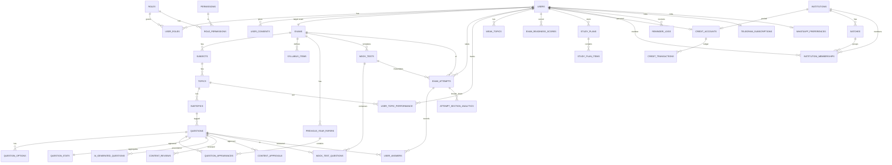

# Entity-Relationship Diagram (extract)

> **Source of truth:** `database_schema.md` (full tables, types, constraints, indexes, DDL, Django models).

```mermaid
erDiagram
    USERS ||--o{ USER_ROLES : has
    ROLES ||--o{ USER_ROLES : grants
    ROLES ||--o{ ROLE_PERMISSIONS : has
    PERMISSIONS ||--o{ ROLE_PERMISSIONS : in
    USERS ||--o{ USER_CONSENTS : gives
    USERS }o--|| EXAMS : "target exam"

    EXAMS ||--o{ SUBJECTS : has
    SUBJECTS ||--o{ TOPICS : has
    TOPICS ||--o{ SUBTOPICS : has
    EXAMS ||--o{ SYLLABUS_ITEMS : defines
    EXAMS ||--o{ PREVIOUS_YEAR_PAPERS : has

    SUBTOPICS ||--o{ QUESTIONS : tagged
    QUESTIONS ||--o{ QUESTION_OPTIONS : has
    QUESTIONS ||--o{ QUESTION_APPEARANCES : appeared
    PREVIOUS_YEAR_PAPERS ||--o{ QUESTION_APPEARANCES : contains
    QUESTIONS ||--|| QUESTION_STATS : aggregates
    QUESTIONS ||--o{ AI_GENERATED_QUESTIONS : "provenance"
    QUESTIONS ||--o{ CONTENT_REVIEWS : reviewed
    QUESTIONS ||--o{ CONTENT_APPROVALS : approved

    EXAMS ||--o{ MOCK_TESTS : templates
    MOCK_TESTS ||--o{ MOCK_TEST_QUESTIONS : composes
    QUESTIONS ||--o{ MOCK_TEST_QUESTIONS : in

    USERS ||--o{ EXAM_ATTEMPTS : takes
    EXAMS ||--o{ EXAM_ATTEMPTS : of
    MOCK_TESTS ||--o{ EXAM_ATTEMPTS : instantiates
    EXAM_ATTEMPTS ||--o{ USER_ANSWERS : records
    QUESTIONS ||--o{ USER_ANSWERS : answered
    EXAM_ATTEMPTS ||--o{ ATTEMPT_SECTION_ANALYTICS : breaks_down

    USERS ||--o{ USER_TOPIC_PERFORMANCE : tracks
    TOPICS ||--o{ USER_TOPIC_PERFORMANCE : per
    USERS ||--o{ WEAK_TOPICS : has
    USERS ||--o{ EXAM_READINESS_SCORES : scored
    USERS ||--o{ STUDY_PLANS : owns
    STUDY_PLANS ||--o{ STUDY_PLAN_ITEMS : contains

    CREDIT_ACCOUNTS ||--o{ CREDIT_TRANSACTIONS : ledger
    USERS ||--o| CREDIT_ACCOUNTS : "personal"
    INSTITUTIONS ||--o| CREDIT_ACCOUNTS : "pooled"

    INSTITUTIONS ||--o{ BATCHES : has
    INSTITUTIONS ||--o{ INSTITUTION_MEMBERSHIPS : members
    BATCHES ||--o{ INSTITUTION_MEMBERSHIPS : groups
    USERS ||--o{ INSTITUTION_MEMBERSHIPS : member

    USERS ||--o{ REMINDER_LOGS : receives
    USERS ||--o| TELEGRAM_SUBSCRIPTIONS : links
    USERS ||--o| WHATSAPP_PREFERENCES : links
```
